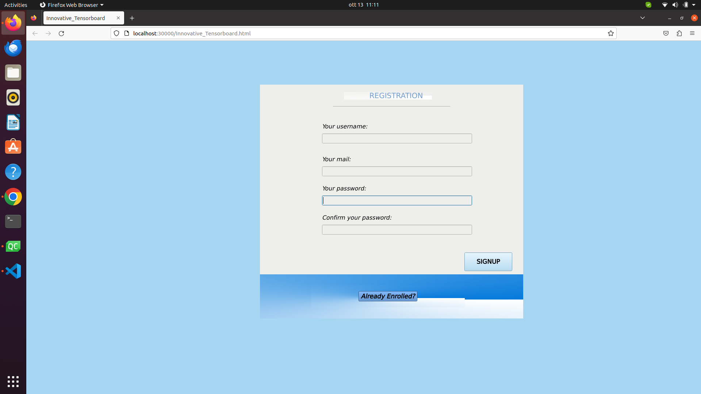
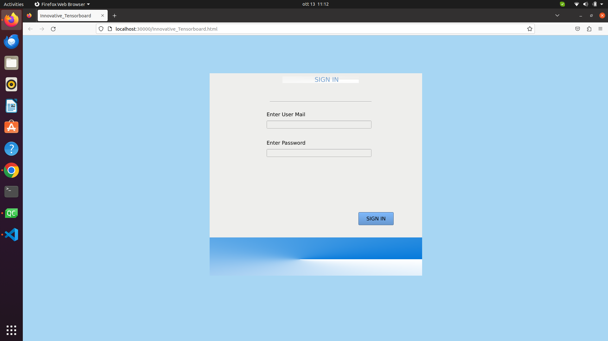
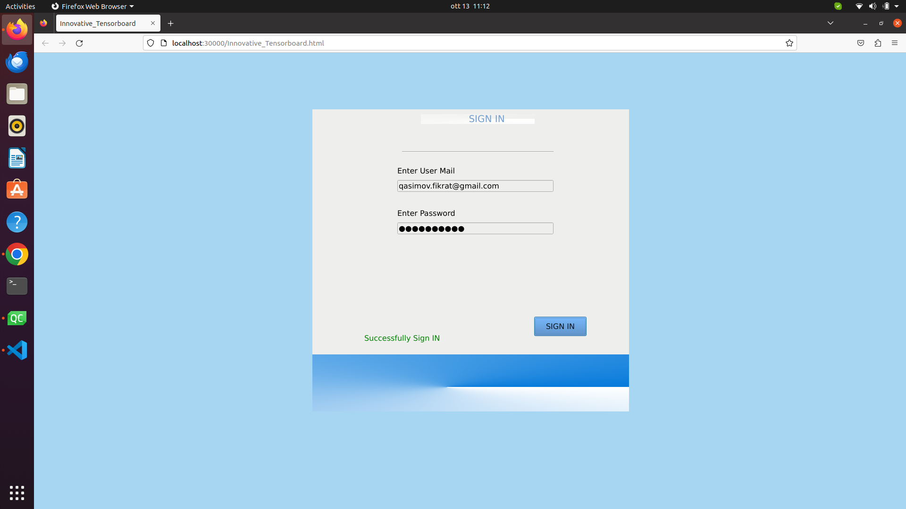
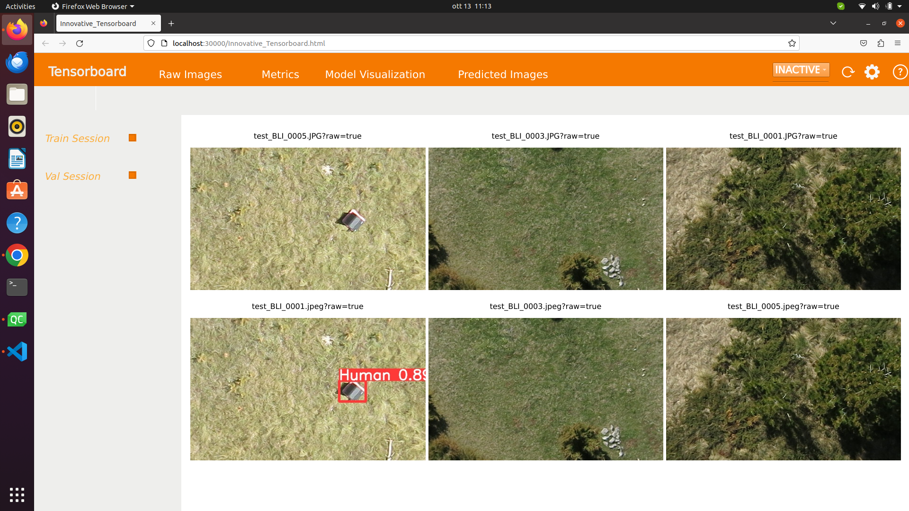
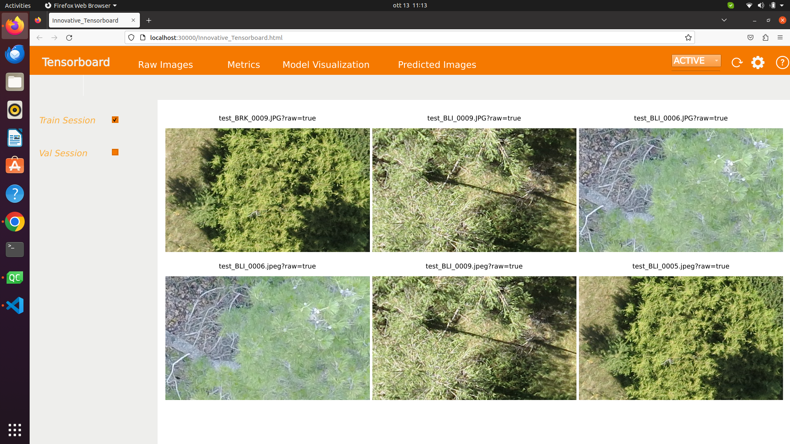

# This is Tensorboard Visualization for Deep Learning Models
```
   1. Database is MySql Server
   2. C++ Qt Web Assembly 6.2.4
   3. Registration Page with ui interface
   4. Sign page with ui interface 
   5. Flask Rest API manages post/get/put request accordingly!
```

# ProtoType looks like as the following:





